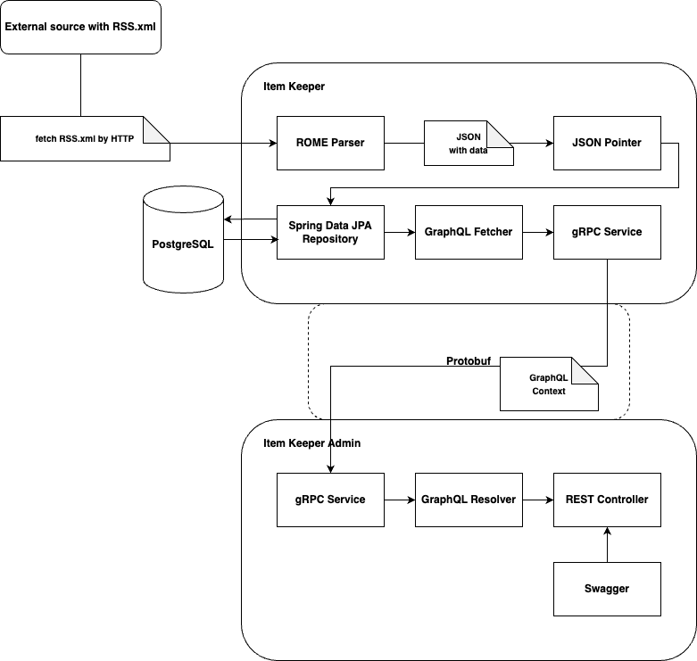

# Content Distribution System as a Component of the Development of Social Mechanics in a Financial Application (Item Keeper Service)

## Problem Statement
The key goal of this project is to develop a backend system for parsing RSS news data sources and creating selection of news articles from these parsed data.

## Author
**Maria Manakhova** 
MSc Student at Machine Learning and Data-Intensive Systems program, Higher School of Economics 
Telegram: [@mxmanakhova](https://t.me/mxmanakhova) 
Mail: msmanakhova@edu.hse.ru

## Supervisors
**Arakcheev Anton** 
IT Team Lead at Tinkoff 
Telegram: [@Graph_AAC](https://t.me/Graph_AAC) 
Mail: a.arakcheev@tinkoff.ru

**Danzan Shurkaev** 
[должность?] 
Telegram: [@DanzanSh](https://t.me/DanzanSh) 
Mail: d.shurkaev@tinkoff.ru

## Work Plan
|                                                                                                                                               | Deadline               |
|-----------------------------------------------------------------------------------------------------------------------------------------------|------------------------|
| System architecture development. Database schema design. Technology stack selection.                                                          | 28th of December, 2023 |
| Development of a service for automated data uploading (Item Keeper): basic data fetching and parsing, cronjob setup.                          | 14nd of February, 2024 |
| Development of Item Keeper service: parsing RSS data with mapping configuration, storing parsed data in database, data fetching with GraphQL. | 4th of March, 2024     |
| Development of a service for creating news articles selection (Item Keeper Admin): development of GraphQL resolver, Swagger UI.               | 25th of March, 2024    |
| Containerisation of a backend system with Docker. Minor services improvement.                                                                 | 15th of April, 2024    |
| Finalization of web services development. Testing of the developed backend system.                                                            | 1st of May, 2024       |
| Minor bug fixes. Development of a project documentation.                                                                                      | 10th of June, 2024     |

## Description of Used Data
Used data is stored in RSS (Rich Site Summary) format, which is a subtype of XML format. RSS data is provided by most news websites, for example, [RBC](http://static.feed.rbc.ru/rbc/logical/footer/news.rss).

The common data that is provided in RSS files:
1. Information about the news source (name of the news source, logo picture, language)
2. A list of latest news articles, containing following information:
   * news headline (title)
   * link to the news (link)
   * date of publication of the news (pubDate)
   * news description (description)
   * news category (category)
   * guid

Depending on the source, RSS files could also contain:
   * full text of the news article
   * identifier of the news article
   * tags related to key details of the news article
   * and much more

The frequency of data updates depends on the source.

Data parsing is implemented via usage of ROME framework for RSS and Atom feeds, JSON Pointer and mapping configuration file in JSON format.

## Final Product Description
The final product is a backend system consisting of two web services:

### 1. Item Keeper service
Item Keeper is a service that is required for parsing data from RSS files of news sources by a cron job and storing parsed data in PostgreSQL database.

**Technology Stack:** 
* Programming Languages: Kotlin, GraphQL
* Frameworks: Spring, gRPC, Quartz
* Database: PostgreSQL
* Other: Rome, Spring Data JPA, JSON Processing API, Docker

### 2. Item Keeper Admin service
This service is required for creating selection of news articles from the data provided by Item Keeper service.

**Technology Stack:**
* Programming Languages: Kotlin, GraphQL
* Frameworks: Spring, gRPC
* Other: Swagger, Docker