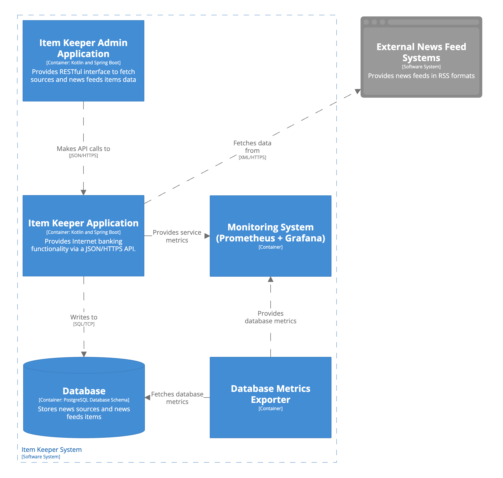
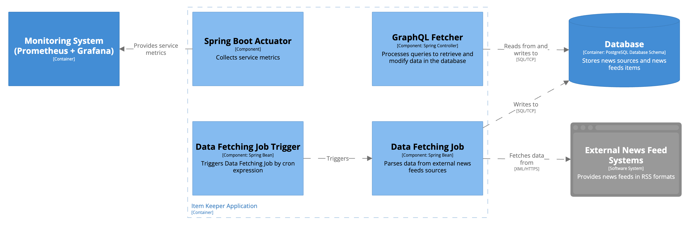
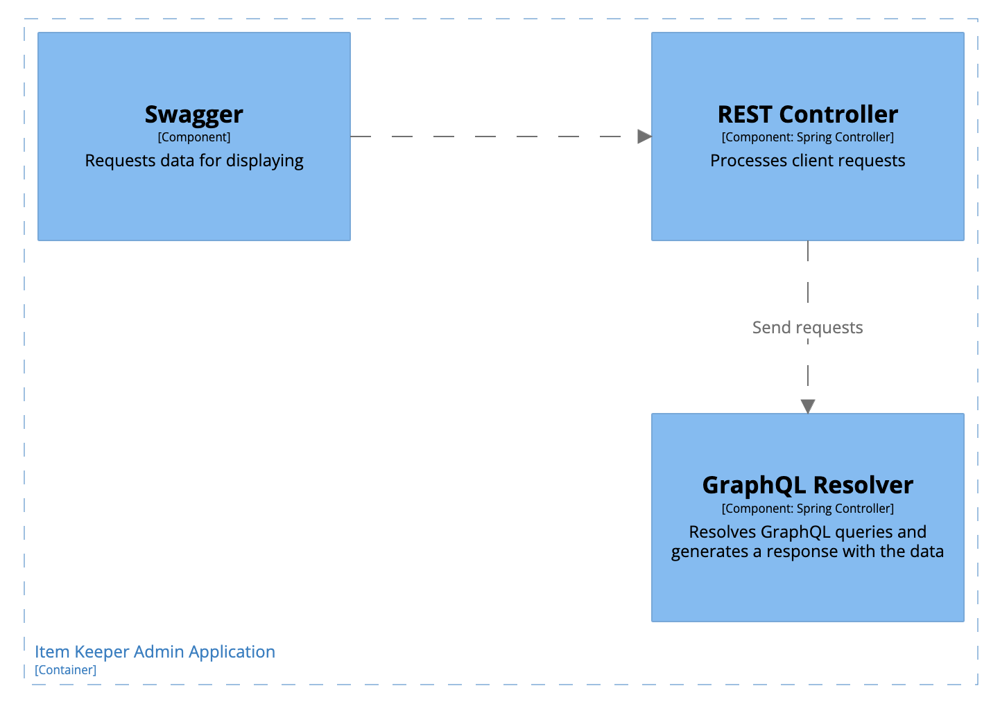
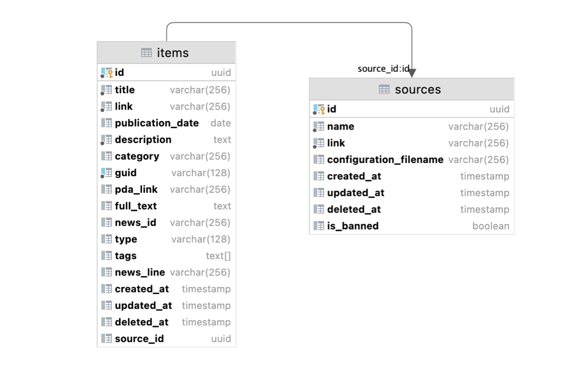
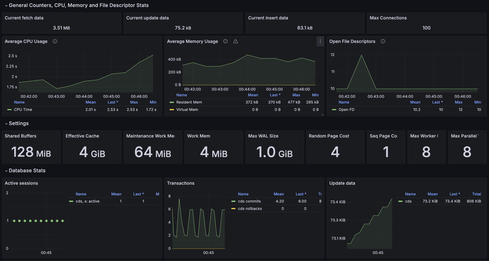
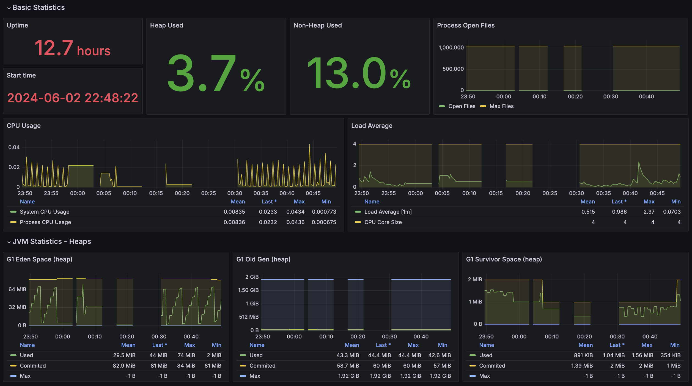
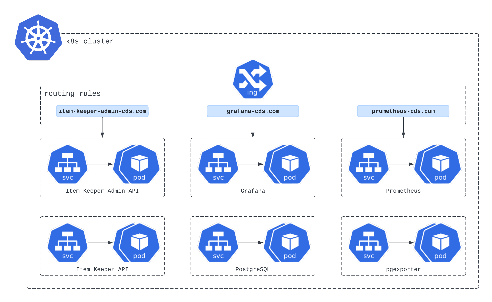

         

# Content Distribution System as a Component of the Development of Social Mechanics in a Financial Application

## Problem Statement
The main objective of this project is to develop a platform for managing news compilations or feeds that allows to retrieve articles from various data sources and store them for later distribution. The developed backend system serves as a centralized hub where publishers, content creators and consumers can access, organize and efficiently distribute news content.

## Description of Used Data
Used data is stored in RSS (Rich Site Summary) format, which is a subtype of XML format. RSS data is provided by most news websites, for example, [RBC](http://static.feed.rbc.ru/rbc/logical/footer/news.rss).

The common data that is provided in RSS files:
1. Information about the news source (name of the news source, logo picture, language)
2. A list of latest news articles, containing following information:
   * news headline (title)
   * link to the news (link)
   * date of publication of the news (pubDate)
   * news description (description)
   * news category (category)
   * guid

Depending on the source, RSS files could also contain:
* full text of the news article
* identifier of the news article
* tags related to key details of the news article
* and much more

The frequency of data updates depends on the source.

Data parsing is implemented via usage of ROME framework for RSS and Atom feeds, JSON Pointer and mapping configuration file in JSON format.

## Final Product Description
The final product is a backend system consisting of two web services:

### 1. Item Keeper service

Item Keeper is a service that is required for parsing data from RSS files of news sources by a cron job and storing parsed data in PostgreSQL database.

**Technology Stack:**
* Programming Languages: Kotlin, GraphQL
* Frameworks: Spring, Quartz
* Database: PostgreSQL
* Other: Spring Data JPA, JSON Processing API, Gradle

### 2. Item Keeper Admin service
This service is required for creating selection of news articles from the data provided by Item Keeper service.

**Technology Stack:**
* Programming Languages: Kotlin, GraphQL
* Other: Swagger, Gradle

### Database scheme

### Monitoring
System monitoring is implemented using pgexporter for database metrics, Spring Boot Actuator for web services metrics, Prometheus for scraping and Grafana for visualisation

### Deployment 

